## <a name="connection"></a> Connecting with the AfriMove Database

*Please not that in some picture you might find a reference to eurodeer_db instead of afrimove_db. All the example works perfectly once you replace eurodeer with afrimove as (at the moment) they are hosted on the same server.*

[PostgreSQL](https://www.postgresql.org/) is a database server. The role of the database server is to distribute data to client applications keeping the data into a centralized repository. Many different interfaces can be used. Some are focused on the creation, maintenance and development of the database, others to visualize and edit/manipulate tabular or spatial data. Statistical tools can be used to perform analysis on the data. Many graphical interface can be used to offer data in a user-friendly fashion, including through web applications.  
Users with a permission to access the data can use their favourite application. Examples of how to connect with the database from different software tools are reported in the next sub-section.   
You do **NOT** need to install PostgreSQL to connect with AfriMove db. The database is stored on a PostgreSQL server at the Edmund Mach Foundation. You only need a client application, or, in the case of phpPgAdmin, a web browser (e.g. Mozilla Firefox).

Any client need the following parameters to connect with the database:

	  IP or Domain name of the server: eurodeer2.fmach.it
	  Server Port: 5432
	  Name of the Database: afrimove_db
	  User Name: ...
	  Password: ...

If you don't have yet a user account (and you are entitle to have one) please contact Emily Bennitt or Ferdinando Urbano. We will create an account for you (with a permission level that corresponds to your role in the project)

In the next subsections, you can learn how to connect, visualize data and download data with a set of client applications.

### <a name="phpPgAdmin"></a>phpPgAdmin
phpPgAdmin is a web-based administration tool for PostgreSQL written in PHP. You can see the database content, display and download data and run any SQL statement. You do not need to install any software as it only requires that you have a web browser.  
The interface is very intuitive and similar to PgAdmin, with a structure pretty similar to a file system explorer.    
While for basic operations this tool is very good, we recommend to use pgAdmin for more intense or sophisticated interactions with the database.

To connect with the database, go to the web page [http://eurodeer2.fmach.it/phppgadmin/](http://eurodeer2.fmach.it/phppgadmin/) and enter your credentials (see image below).

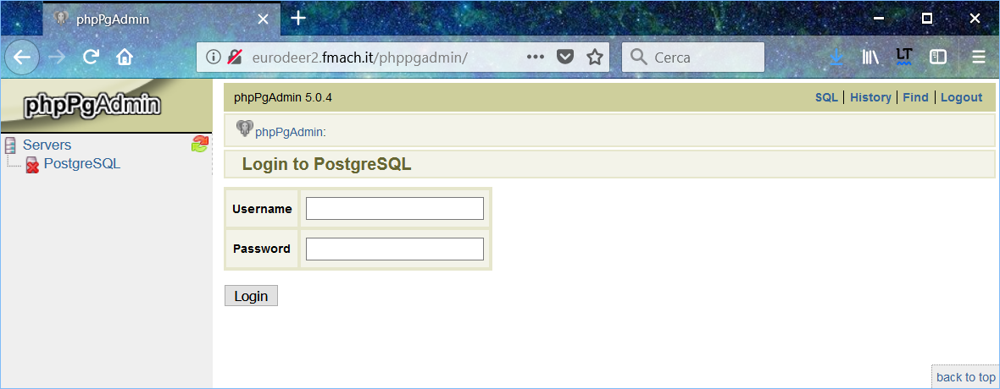

Once connected, you will see a list of database. While you can see the structure of all the database, you will only be able to access data in the database for which you are enables (i.e. eurodeer_db). You can explore the database content using the navigation menu in the left panel. Open the schema you are interested it (in most of the cases it is *main*) and select a table. In the right panel you will see the list of fields (columns) in the table with a description of their content.  
To visualize the data, click on **Browse**, to download the data in a set of possible formats (including .csv) click on **Export** (see image below).

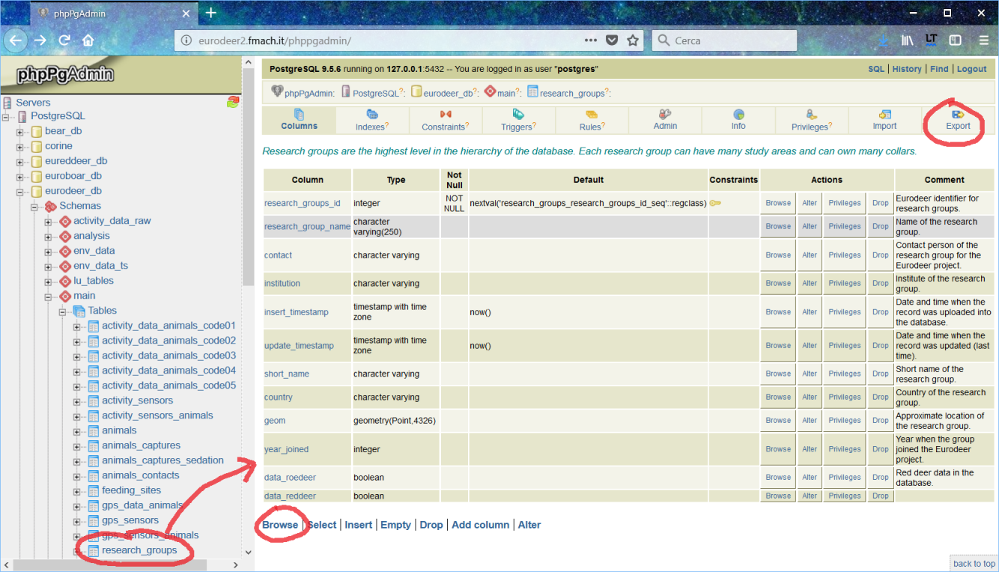

If you want to run a query (i.e. SQL code), click on **SQL** on the upper right (see image below). A new window will open where you can write your SQL. Click on **EXECUTE** to see the results on the main page.

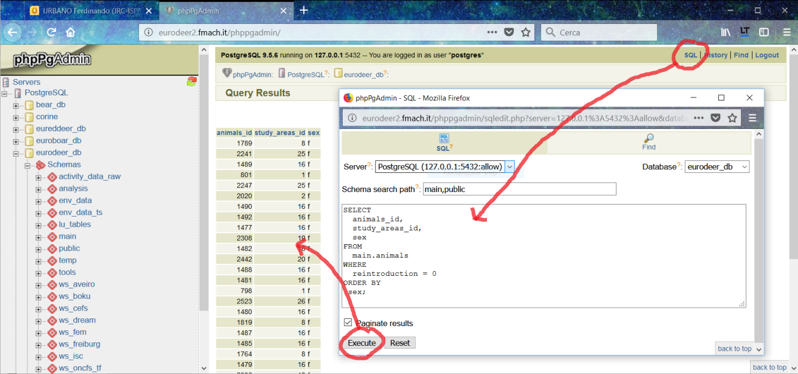

### <a name="pgAdmin"></a>pgAdmin
[PgAdmin](https://www.pgadmin.org/) is the most popular and feature rich Open Source administration and development platform for PostgreSQL. There are two versions: 3 and 4 (the former is more intuitive, the latter more modern and powerful but without some key features available in version 3). Note that eurodeer_db uses PostgreSQL 9.5 that is compatible with both versions. This is the best tool to manage the data and explore both structure and content, including the formulation of advanced queries and the creation of new database objects.
Here below and example of the window with the connection parameters. The interface is very similat to that of phpPgAdmin.

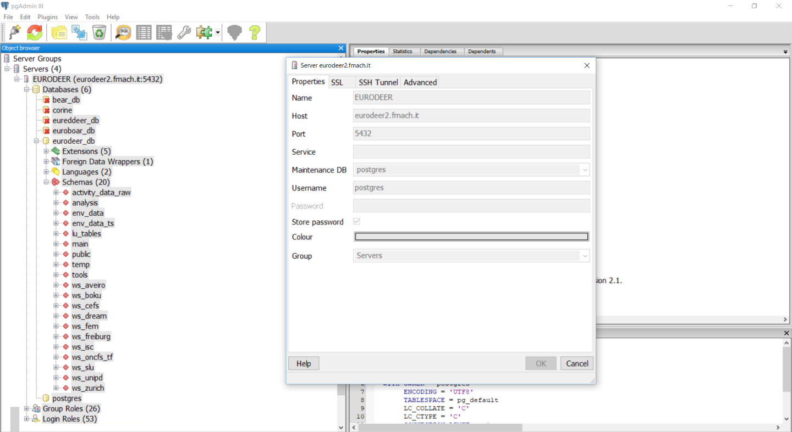

And this is the interface of pgAdmin4.  

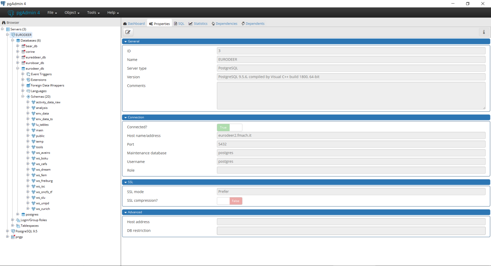

To visualize data, click on the table in the left panel and then on the **table** icon on the menu (see below). You can add criteria (menu: **Tools/Sort-Filter**) to order the record and/or limit the selection to a subset of records.
If you select rows, you can copy/past the records as comma-separated values.

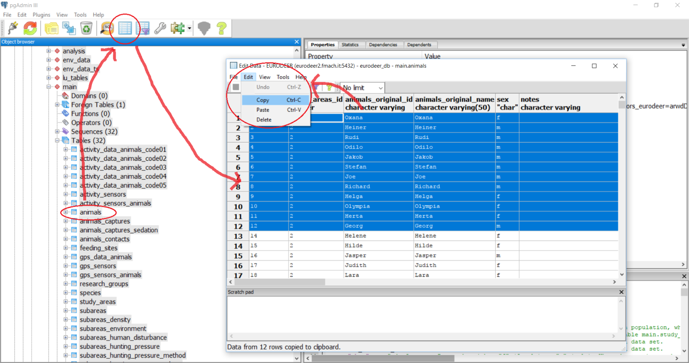

There are other (better) ways to export data. The easiest one is to write the SQl query in the SQL window (clicl on the **SQL** icon, see image below). Then, instead of simply run the query, click the button to write the data to an external .csv file (see image).  

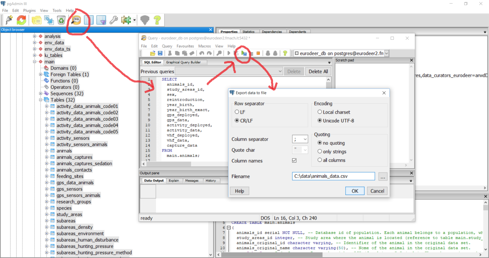


### <a name="QGIS"></a>QGIS 

[QGIS](www.qgis.org) is a desktop GIS that is very well integrated with PostgreSQL and PostGIS and offers a large set of tools to deal with spatial data in the database. Connecting to the database is pretty simple and the process is well documented, for example [here](http://docs.qgis.org/2.18/en/docs/training_manual/databases/index.html). Data can be accessed in three steps: create a connection to the db. Open the connection. Get the data.  
 
The first time you connect with the database, you must create the connection using the **Add PostGIS Layer** icon (see screenshot below) and insert the connection parameters.

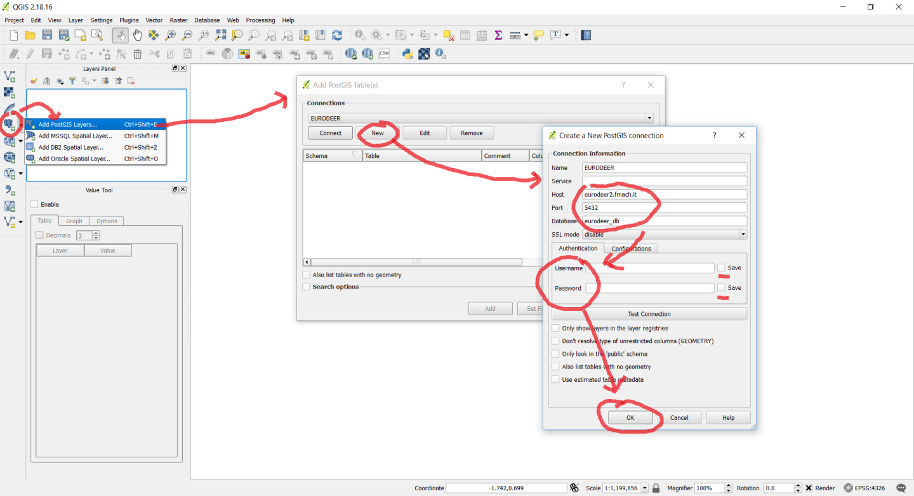

Once the connection is created, you can use the **DB Manager** interface (see below) where you can explore, preview, visualize in the main canvas and also export spatial data (both vector and raster).  
If you want to export AfriMove data in shapefile format, we reccomend to load the layer: **main.view_afrimove_gps_positions_shp**.

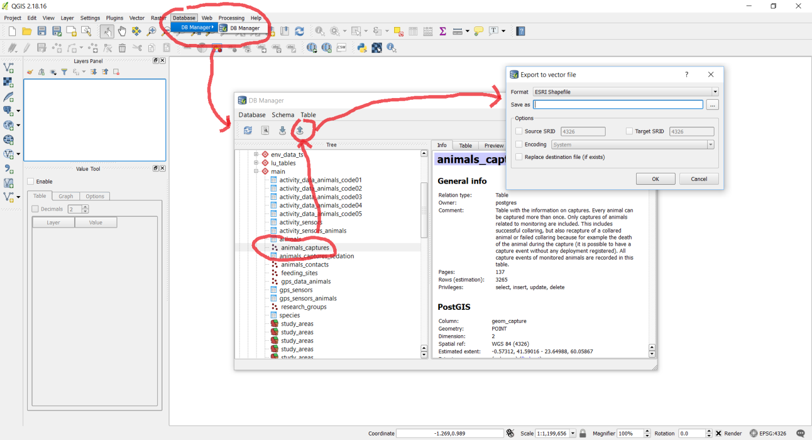

An interesting feature in QGIS is the possibility to visualize AfriMove data on top of one of the main global spatial layers like Google map or Bing map.

### <a name="R"></a>R

You can easily import data from the database into [R](https://www.r-project.org/) using a code like the one reported below (through the library RPostgreSQL):

```R   
library(RPostgreSQL)  
drv <- dbDriver("PostgreSQL")  
con <- dbConnect(drv, dbname="afrimove_db", host="eurodeer2.fmach.it", port="5432", user="YOURUSER", password="YOURPASSWORD")  
rs <- dbSendQuery(con, "select * from main.view_afrimove_gps_positions_r")  
df <- fetch(rs,-1)  
df[1:4,]  
str(df)  
dbClearResult(rs)
```
  
In the *dbSendQuery* command, you can include any SQL code.

Note that in the database is activated [Pl/R](http://www.joeconway.com/plr.html), a tool that permits to embed R code into SQL. Contact us if you want to explore this possibility. 

### <a name="LibreOffice"></a>LibreOffice

BASE and CALC are two tools of the suite [LibreOffice](https://www.libreoffice.org/) that allow the connection with the database and offer the possibility to create queries with graphical tools, build masks, edit the data (if you have the permission to do so) in a user-friendly environment (BASE, equivalent of MS ACCESS) and visualize the information as spreadsheet (CALC, but in this case it is not possible to modify the data stored in the database).  
First of all, you have to create a connection with the database in BASE (see the two images below for the parameters to insert in the first two steps, then enter your credentials and save and register the connection).

 

Once created the connection, you will be able to visualize all the eurodeer_db tables, create form and design queries with a graphical interface.


If you want to visualize and maniputale the data in CALC (equivalent of MS EXCEL), once you created the connection with CALC, you can load eurodeer_db tables though the **Data Source Manager** (to visulize it, go to View/Data Source, see image below).

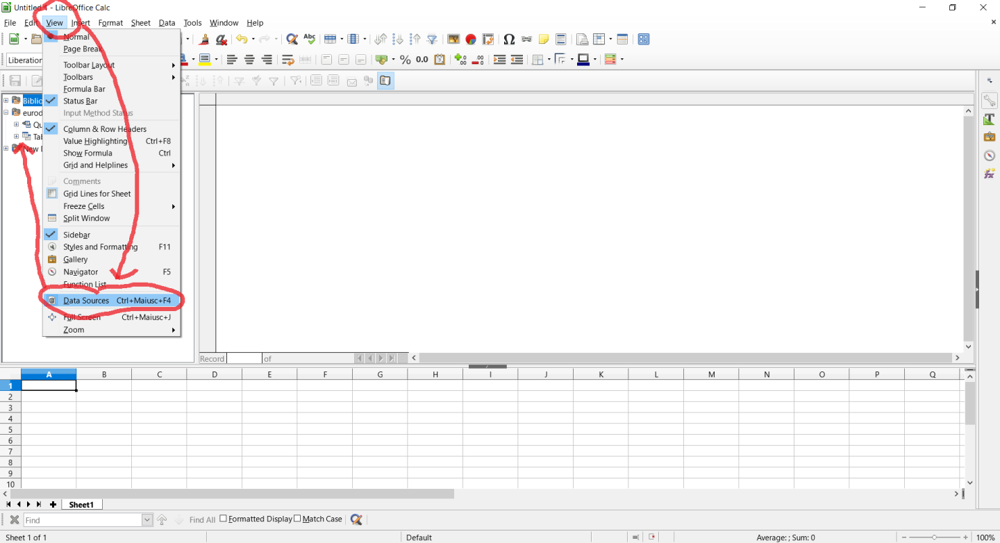

Now you can simply drag and drop the table into the spreadsheet panel (see below): Note that changes made in the spreadsheet are not reflected into the database.

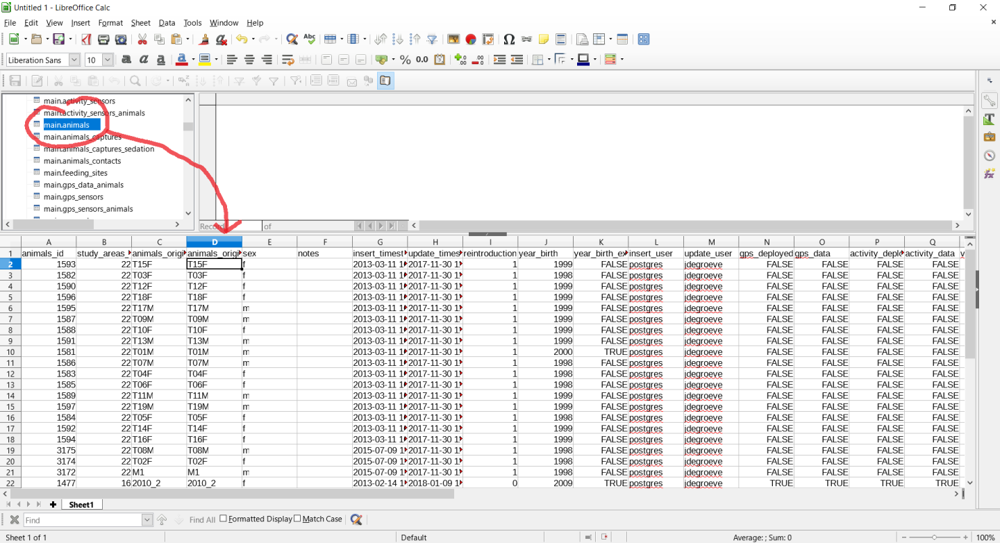

### <a name="Others"></a>Other Client Tools 

There are may other clients that can be easily connected with PostgreSQL. SOme examples are SAS, STATA, MS ACCESS, MS EXCEL, ArcGIS. Most of the functionalities offered by these commercial tools are covered by The open source tools listed above. If you are used to deal with data with other tools, you can check the software specific documentation about how to connect with a PostgreSQL/PostGIS database.
