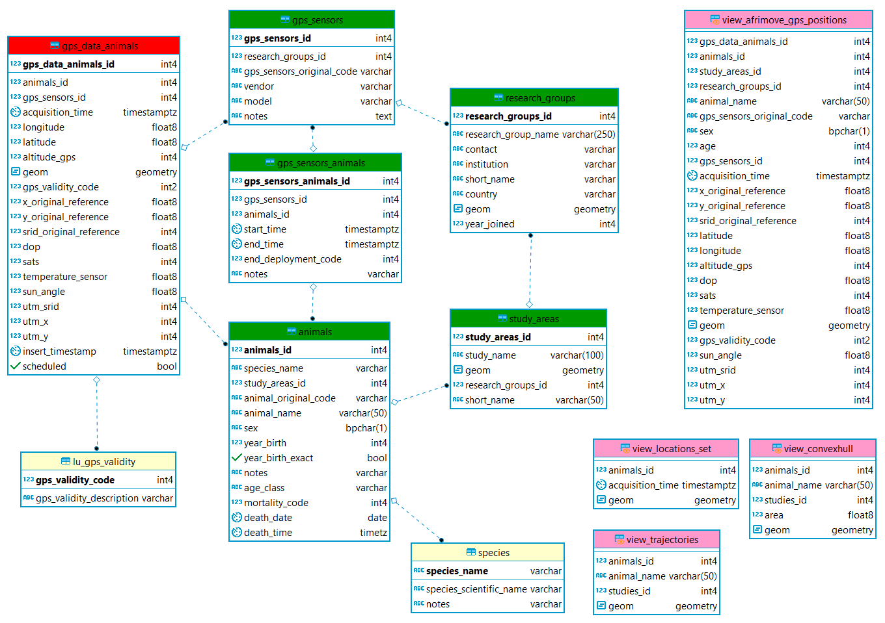

# USER GUIDE	

* [Introduction](#Introduction)
* [Database Overview](#AFRIMOVE_Overview)
* [Database Content](#AFRIMOVE_Content)  
* [Database Objects Description](#AFRIMOVE_Objects)  

## <a name="Introduction"></a> Introduction  

The primary content of this manual is the technical documentation about the use of **AFRIMOVE database** for the project partners. After a general introduction to the project, the section **[Database Overview](#AFRIMOVE_Overview)**, illustrates the characteristics of the AFRIMOVE e-infrastructure and the data processing (acquisition, harmonization, quality check). It also provides a very general overview of the main features of relational databases for they who do not have any background in data management. In the section **[Database Content](#AFRIMOVE_Content)**, we describe the data that are stored in the AFRIMOVE database and how they are organized.  The section **[Database Objects Description](#AFRIMOVE_Objects)** provides the information to retrieve the description of each table and field stored in the database.  

Note that this is not a comprehensive manual about database. It shortly describes the AFRIMOVE database content and the main operations that can be done on it. For an introduction to the database language (Structured Query Language, SQL) you can explore one of the many online tutorials. In particular, the **[training material](https://github.com/feurbano/data_management_2018/)** of the course "Dealing with Spatio-temporal Data in Movement and Population Ecology", June 17-22 2018 - Trento, Italy, which is specifically tailored on movement data (and that uses the same database structure as AFRIMOVE).
Other open tutorials, guides and courses available on the webare, for example:
  
* [PostgreSQL official tutorial](https://www.postgresql.org/docs/current/static/tutorial.html)
* [postgresqltutorial](http://www.postgresqltutorial.com/)
* [w3resource](https://w3resource.com/PostgreSQL/tutorial.php)
* [sqlbolt](https://sqlbolt.com/)
* [webcheatsheet](http://webcheatsheet.com/sql/interactive_sql_tutorial/)
* [www.sql.org](www.sql.org)

For an introduction to PostGIS (the spatial extension of PostgreSQL) give a look here:

* [PostGIS into by BoundlessGeo](http://workshops.boundlessgeo.com/postgis-intro/)

In addition, for they who want to understand the technicalities of (or replicate the) EURODEER database structure and tools or to get more skills on data management for wildlife tracking data, we suggest the book **[Spatial Database for GPS Wildlife Tracking Data- A Practical Guide to Creating a Data Management System with PostgreSQL/PostGIS and R](https://www.springer.com/us/book/9783319037424)** (Urbano & Cagnacci Ed., 2014). Contact the AFRIMOVE coordinator if you want a digital version of the chapters of the book (for AFRIMOVE partners).

AFRIMOVE **database manager** (Ferdinando) and **data curators** (Melinda and Victoria) are always available for AFRIMOVE database users whenever technical support is needed. For example for:  

* preparation of data before they are sent to EURODEER for uploading to the shared database
* creation/management of users
* advanced manipulation of data, specially for research connected with AFRIMOVE papers 
* use of environmental data or integration of new ancillary data sets
* questions on data content
* fix of data errors
* export of data in a format more familiar to AFRIMOVE partners

The [AFRIMOVE spatial databases](http://eurodeer2.fmach.it/phppgadmin/) is hosted at [Edmund Mach Foundation](http://www.fmach.it/).

More information on the projects, including activities, partners, outcomes and news can be found at the [AFRIMOVE website](http://www.AFRIMOVE.org).

The participation to the project and the use of the data stored in the database is ruled by the Terms of Use signed by each partner. It is a kind of gentlemen agreement mainly based on good sense. The most important point is *"[...] The Partners maintain full property and control of their own dataset [...]"*. No ownership is transferred and data are used only if data owners explicitly authorize it for each specific research. This also mean that data are not open to the public. But the network is open to any interested scientist.

The content of this guide is largely taken (and adapted) from the **[EURODEER project user guide](https://github.com/eurodeer/eurodeer_db)**.

## <a name="AFRIMOBE_Overview"></a> Database Overview

The main goal of AFRIMOVE project is to join and harmonize tracking data of African animals and additional information from different research groups located in different countries in a common data repository. To achieve this goal, we set up a software platform that enables all partners to access, manage and analyze the shared data in a cost-effective fashion. The main requirements of the project and the assessment of possible solutions are described in the paper [Wildlife tracking data management: a new vision ](http://rstb.royalsocietypublishing.org/content/365/1550/2177)(Urbano et al., 2013).

The main technical result is a relational database management system with a spatial extension, built on the open source software [PostgreSQL](www.postgresql.org) (at 2018, version 9.5) and [PostGIS](www.postgis.org) (at 2018, version 2.3). It also includes the extension [Pl/R](https://github.com/postgres-plr/plr) that allows the integration of R tools into the database. The AFRIMOVE database is physically installed on a server at Edmund Mach Foundation, but it is accessible from everywhere in the world (by users with registered account). It works as a centralized server that sends data, when requested, to client applications. A client is a software that accesses the remote service (database) on another computer system (server), by way of a network; the client application can be located anywhere and multiple connections to the database can be managed at the same time. Example of client applications are those used to manage the data (e.g., pgAdmin, phpPgAdmin), visualize spatial information (e.g., QGIS, ArcGIS) or perform analysis (e.g., R).

The server-client structure of the system offers the opportunity to build a very flexible and modular software platform, as any software able to connect to the central database can be integrated. Storing, managing, accessing and analysing GPS data from several research groups throughout Europe is thus possible, while each researcher can use its favourite software application, preserving the consistency of the data and avoiding data duplication with connected risk of errors. The most used applications to interact with the AFRIMOVE database are Desktop GIS, statistics and Web tools, as well as office suites. 

In the document [Database connection](https://github.com/afrimove/afrimove_db/blob/master/db_documentation/db_connection.md) you can see some of these applications and how to connect them with the AFRIMOBE database, while in [Database Content](#AFRIMOVE_Content) and [Database Objects Description](#AFRIMOVE_Objects) you can explore database structure and content.  
In this section, you find an overview of the whole process from data acquisition to data ingestion into the AFRIMOVE database, with a very short introduction to the main features of relational database. 

### AFRIMOVE data work flow

#### Data collection
Data stored in the afrimove_db is collected by project partners who fully own the data. No data are collected by AFRIMOVE project itself, which is instead a project to share data of individual institutions. 

#### Data harmonization
A challenging part in the creation of the afrimove_db is the harmonization of data sets from different sources. First of all, it is necessary to identify a set of information that are collected by all (or at least most of) the partners. Then, even when the information is related to the same objects phenomena, it can be collected, coded or stored in different ways (e.g., sampling methods, units, classes). The data have been processed to speak "the same language". In some cases this requires the aggregation of the original data, but this is the only way to run analysis over different areas and environmental gradients.  
Particularly, data owners are asked (with the support of the AFRIMOVE data curators) to format the data in order to be consistent with the afrimove_db. Then, it is up to the database manager and data curators to process data and upload into the database.

#### Quality checks

Tracking data (and in general wildlife monitoring data) can potentially be affected by a large set of errors in different steps of data acquisition and processing. Erroneous data can heavily affect analysis, leading to biased inference and misleading wildlife management/conservation suggestions. Data quality assessment is therefore a key step in AFRIMOVE data management. In fact, a key step in the upload of data from partners to the shared database is quality check. Even if data are supposed to be quality checked by data owners, thanks to the procedures and protocols implemented into the database (and to the functionalities available in a proper database vs other simpler way to store data), many potential errors and inconsistencies are detected when screened by data curators. The errors are then reported to data owners who provide the information to fix them, in an iterative process that might require several steps. No data is removed from the data set. Erroneous information are flagged as such keeping the synchronization with the original data set. While in some cases incorrect data are evident, in many situations, it is not possible to clearly identify information as outliers (even by they who collected the information) because although they are suspicious they might still be correct, leaving a margin of uncertainty. In this case a specific flag is used so data can be excluded from analysis, according to the criteria defined in each case.  
The continuous quality check, not only through automated algorithms, is a distinctive trait of the AFRIMOVE approach as compared to other larger shared repository. And this is because quality of scientific output is the main concern of the project.

### A very short introduction to database for data management

#### Database and spatial database
A database is an application that can store and manage a large amount of data very efficiently and rapidly. The relational bit refers to how the data is stored in the database and how it is organized. In a relational database, all data is stored in tables. These have the same structure repeated in each row (like a spreadsheet) and it is the relations between the tables that make it a "relational" table.  
The use of a RDBMS has several advantages.

* It has a persistent and very large data storage capability.
* GPS data can be linked to complex spatial and non-spatial data in a common data structure.
* Multiple users can simultaneously access to data with different permissions levels.
* It has the ability to manage different time and spatial reference systems in the same frame.
* It has fast data search and retrieval capabilities.
* It supports controls on data consistency and reduce errors.
* It can implement automated procedures to receive, screen, and store data from GPS telemetry devices.

Spatially enabled relational database management systems (also called "spatial database", "Spatial Relational DataBase Management System - SRDBMS", "geodatabase") are database designed to store, query, and manipulate spatial data. The main advantage of SRDBMS, as compared to flat file based spatial data storage, is that they let a GIS build on the existing capabilities of RDBMS. This includes support for SQL and the ability to generate complex geospatial queries. While traditional GIS are focused on advanced data analysis and visualization, providing a rich set of spatial operations, on few data; spatial databases allow simple spatial operations which can be efficiently undertaken on a large set of elements. This approach suits perfectly the peculiarities of GPS data. Spatial database and GIS software can be integrated in the EURODEER platform, to take advantages of both approaches.

#### SQL
The database support SQL language. SQL is short for Structured Query Language and is a simple language that provides instructions for building and modifying the structure of databases and, most importantly for EURODEER users, for retrieving and modifying the data stored in the tables. 

SQL commands have a syntax similar to the common language. They begin with a command statement describing the action to take (e.g. SELECT), followed by a clause that describes the target of the command (such as the tables affected by the command) (e.g. FROM) and finally, a series of clauses that provide additional instructions that usually specify the subset of data needed by the users (WHERE).

An example is : 

```sql 
SELECT animal_id FROM main.animal WHERE sex = 'f';
```

The information returned is the *animals_id* stored in the table *main.animals* (i.e. name of the schema + "." + name of the table) for all those individuals that are female.

The SELECT clause specifies one or more columns to be retrieved; to specify multiple columns, use a comma and a space between column names. To retrieve all columns, use the wild card * (an asterisk).  
The FROM clause specifies one or more tables to be queried. Use a comma and space between table names when specifying multiple tables.  
The WHERE clause selects only the rows in which the specified column contains the specified value. The value is enclosed in single quotes when it is a text.  
The semicolon (;) is the statement terminator.   
SQL is not case sensitive (i.e., SELECT is the same as select).

Although there are different dialects of SQL, it is very standardized and the same syntax can be used with minimal changes in most of the commonly used database platform (both commercial and open source).

There are many (but not too many) other SQL commands to retrieve data (e.g. order by, limit, left/right join, group by, having) and a long list of useful functions to deal with the different data types. Some resources where you can learn more about SQL are suggested in the [Introduction](#Introduction).  

The **[training material](https://github.com/feurbano/data_management_2018/)** of the course "Dealing with Spatio-temporal Data in Movement and Population Ecology", June 17-22 2018 - Trento, Italy, is specifically tailored on movement data and makes use the same database structure as AFRIMOVE, so it can be a useful reference.

#### Main database objects
* **Schemas**. A database contains one or more named schemas, which in turn contain tables. Schemas also contain other kinds of named objects, including data types, functions, and operators.  
Schemas are used to organize database objects into logical groups, to make them more manageable, and to allow many users to use one database without interfering with each other. Schemas are similar to folders in a file system.
* **Tables**. The table is where all the data in a database is stored.Each table is made up of rows and columns. Each row in a relational is uniquely  identified by a primary key.  This can be by one or more sets of column values. Every relational table has one primary key.  Its purpose is to uniquely identify each row in the database. Columns are defined to hold a specific type of data, such as dates, numeric, or textual data. A table has a specified number of columns, but can have any number of rows.
* **Data type**. Each column in a table is associated to a data type that specify the kind of information that can stored (e.g. integer, float, text, date, polygons) and therefore the type of operations that can be performed on it (e.g. sum, division, concatenation, calculation of time interval, calculation of an area).
* **Indices**. An index is an optional structure, associated with a table, that can speed data access in a similar way an index in a book can help to find faster the information you are looking for (if the index refers to useful information in your search criteria).
* **Constraints**. Constrains define certain properties that data in a database must comply with. Common kinds of constraints are:
  * **primary key** - value(s) in specified column(s) must be unique for each row in a table and not be NULL; normally each table in a database should have a primary key - it is used to identify individual records
  * **foreign key** - value(s) in specified column(s) must reference an existing record in another table (via it's primary key or some other unique constraint)
  * **not null** - each value in a column must not be NULL
  * **unique** - value(s) in specified column(s) must be unique for each row in a table
  * **check** - an expression is specified, which must evaluate to true for constraint to be satisfied  

* **Triggers**. A trigger is a specification that the database should automatically execute a particular function whenever a certain type of operation is performed on a particular table in the database. The trigger fires a specific function to perform some actions BEFORE or AFTER records are DELETED, UPDATED, or INSERTED in a table. The trigger function must be defined before the trigger itself is created. The trigger function must be declared as a function taking no arguments and returning type trigger. For example, when you insert a new record in a table, you can modify the values of the attributes before they are uploaded or you can update another table that should be affected by this new upload.
* **Views**. A view is the result set of a stored query on the data, which the database users can query just as they would in a persistent database collection object. This pre-established query command is kept in the database dictionary. Unlike ordinary base tables in a relational database, a view does not form part of the physical schema: as a result set, it is a virtual table computed or collated dynamically from data in the database when access to that view is requested. Changes applied to the data in a relevant underlying table are reflected in the data shown in subsequent invocations of the view. 
* **Functions**. A function is a program code that is implemented inside the database using SQL or a set of other languages (e.g. PSQL, Python, C). Functions allow you to create complex processes and algorithms when plain SQL queries alone cannot do the job. Once created, a function becomes part of the database library and can be called inside SQL queries.
* **Domains**. A data domain refers to all the values which a data element may contain. The rule for determining the domain boundary may be as simple as a data type with an enumerated list of values. Domains can help to keep the integrity of the database restricting the accepted values to a set of valid options. A domain can be implemented as list of values stored in the so-called look up table or as a constraint (check) to the specific column. The data type per se limit the set of accepted values (e.g. an integer cannot accept character as valid value).
* **Users**. In a database, multiple users can access data at the same time, and the database server manage the different requests and ensure the consistency of the data. Each user can be associated to different permission levels on different database objects. For example, a defined user can edit and even delete some tables, while can only visualize some other tables or have no access at all on others. The database administration has full control of all database objects. Permissions can also be associated with user groups, in which case new users can be added to each group and will inherit all the related permissions on database objects. 
 
#### Data modelling 
Data models are the logical core of DBMSs and allow linking and integration of data sources by means of complex relationships; this is not only necessary for consistently structuring the database, but is also an extremely useful way to force users to clarify the ecological/biological relational links between groups of data.  
As database systems grow in size and complexity, and user requirements get more sophisticated, (spatial) data modelling becomes more important. A data model in a database framework (typically, relational or object-relational) describes what type of data are stored and how they are organized. It can be defined as a conceptual representation of the real world in database structures that include data objects (i.e. tables), associations between data objects, and rules that govern operations on the objects, thus explicitly determining their spatial and non-spatial relationships.  
Data modelling permits easy update, modification and adaptation of the database structure to accommodate changing goals, constraints and spatial scales of studies, and the evolution of wildlife tracking systems. Without a rigorous data modelling approach, an information system might lose the flexibility to manage data efficiently in the long term.

#### Why open source software 
Although any application that support standard database connection can be used with the EURODEER software platform, the database itself and many powerful applications (e.g., R, QGIS) are open source. Open source software tools were selected, first of all, because there are no resources available to buy software licences. More importantly, we decided to use PostgreSQL/PostGIS because open source tools in the domain of spatial data management and analysis are efficient, powerful and able to support a web-based multi-user environment. They meet all the requirements raised in the requirement analysis as they offer a complete set of software to efficiently implement ecological applications. Another core characteristic of open source tools relevant to the project is the use of standards, specially in the case of database software, that ensure interoperability and thus enable all the project's participants to connect the database with a large set of client applications with no need to buy specific software to exploit the shared information. Adopting international data and metadata standards is the only way to ensure interoperability between different information systems, both within and outside a single organization.


## <a name="AFRIMOVE_Content"></a> Database content


<center></center>

----->

The EURODEER database is the repositories where data coming from the different partners of the EURODEER network are harmonized, stored and shared to be analyzed. The first goal of EURODEER is to investigate variations in roe deer behavioural ecology along environmental gradients or population responses to specific conditions, such as habitat changes, impact of human activities, different hunting regime. Therefore, the main set of data stored into the EURODEER database are those generated by biotelemetry sensors to monitor animals movement, particularly:

* GPS data
* VHF data
* Accelerometer data

These are the core information that was initially collected and shared in the EURODEER framework. After some years, we realized that while these data sets provide a huge mine of data to dig, it is when they are couple with additional information like that of the individuals, populations, management regimes and the environment that they can help to fully decipher the mechanisms of animals movement. This is why in the last years EURODEER has been and is still investing a lot in getting these additional information from each partner, harmonize them and integrate into the analysis. This is a complex process but ultimately it is the biggest added value of the collaboration among scientist on top of the integration into a single repository of the data coming from sensors. The work of data harmonization requires long and iterative discussions but it is also an opportunity to identify good practice (e.g. data collection protocols) that can then be shared with a wider scientific community.

Sensor data sets (GPS, VHF, accelerometer) in addition to the measures collected by the sensors include the list of animals (with key attributes like sex and age), the list and type/model of sensors, and the start and end of sensor deployment (with the reason for the end of deployment).
In addition to sensor data, at the moment in the EURODEER data sets we have information on:

* Research groups, study areas and sub-areas
* Intra- and inter-species interaction and human pressure (predation, competition, human pressure)
* Captures
* Contacts
* Feeding sites
* Environmental data

A short description of the information content of these data sets is reported in the next sub-sections together with a diagram of the data model. In the document **[eurodeer_db Dictionary](eurodeer_db_dictionary.md)** is reported the full description of each table/attribute.

All the core information is stored in the schema **main**, with the exception of the environmental data that are available in the schema **env_data** and the schema **env_data_ts** (for layers with a time series, e.g., NDVI and snow). In the schema **tools** there are the functions created by EURODEER to process and analyze the data (see [functions](eurodeer_db_functions.md)). The schema **analysis** is used to store informations related to analysis that can be reused by all EURODEER partners. The working schema **ws\_*** are spaces where each partner institution can create table and process the data (one per institute). Finally, in the **lu_tables** schema, the database stores all the look up tables, i.e., those tables used to define (code) a valid domain of values for specific fields (e.g., the list of capture methods).

### Research groups, study areas and sub-areas
Sensor data are always related to animals. Each animal is assigned to one (and only one) study area. Each study area belongs to (is monitored by) a research group. The same research group can have more than one study area. Each study area is divided into one or more sub-areas, that roughly recall the concept of population. Each sub-area is characterized by a set of information (human disturbance, performance, predators, interspecific competition, hunting pressure, road density, which are collected every one or more years. Sensors (GPS, VHF, accelerometer) are also attributed to a specific research group.
In the view **main.view_reasearch_groups_euroungulates** all the groups belonging to EUROUNGULATES are reported (through external tables that connect with EUREDDEER and EUROBOAR database).
  
The entity-relationship (ER) diagram of the tables is reported here below (click on it to enlarge).


### GPS data
GPS locations are stored already associated to animals (which is a non-trivial step, specially when the same sensor is associated to different animals once recovered from the previous one). The locations, with a list of derived ancillary information calculated using the information on coordinates and acquisition time, and intersecting with environmental layers are stoerd in the table **main.gps_data_animals**. The original file coming from the sensor is not stored in EURODEER as in the database are shared data already preprocessed by the partners and only quality checked before being uploaded into eurodeer_db. It is important to note that all the outliers are not removed from the dataset but flagged using the field *gps_validity_code*. This includes, among the others, records with no coordinates, records with wrong coordinates, record with suspicious coordinates, records not registered while the sensor was deployed on the animal. When data are analyzed, records must be selected according to the quality level required by the specific analysis.  
The information on the deployment are stored in the table **main.gps_sensors_animals**, including the reasons of the end of the deployment. This table is used to check the correct attribution of locations to animals in the table **main.gps_data_animals**. Information on sensors are stored in **main.sensors**, while the information on animals in **main.animals**. A set of look up tables are used to store the list of valid values for some columns of these tables.  
In the views **analysis.view_convexhull** and ** analysis.view_trajectories** are available the trajectories and convex hull polygons related to each animal (and dynamically updated). These can be loaded in QGIS for spatial visualization. In the view **analysis.view_ltraj_class** data are formatted according to [R adehabitat package](https://cran.r-project.org/web/packages/adehabitat/adehabitat.pdf) to facilitate the import for analysis. See **[eurodeer_db Dictionary](eurodeer_db_dictionary.md)** for the complete list of view associted to GPS data.

The entity-relationship (ER) diagram of the tables is reported here below (click on it to enlarge).
<center></center>

### Environmental data
*WORK IN PROGRESS*

## <a name="AFRIMOVE_Objects"></a> Database Objects Description
Every single object in the afrimove_db (schemas, tables, columns, views, functions) is described inside the database (as [comment](https://www.postgresql.org/docs/devel/static/sql-comment.html)). The descriptions are visible in all db interface (e.g., pgAdmin) when the element is selected. 

----->
An extended report, **[eurodeer_db Dictionary](eurodeer_db_dictionary.md)** that includes the description of the objects of the database (generate with this [SQL code](generate_database_dictionary_sql/generate_dictionary.md) in markdown format, taking the comments from the database itself).

